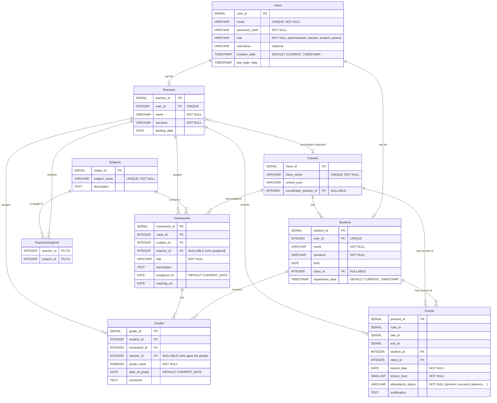

```mermaid
    erDiagram
        Users {
            SERIAL user_id PK
            VARCHAR email "UNIQUE, NOT NULL"
            VARCHAR password_hash "NOT NULL"
            VARCHAR role "NOT NULL (administrator, teacher, student, parent)"
            VARCHAR username "Optional"
            TIMESTAMP creation_date "DEFAULT CURRENT_TIMESTAMP"
            TIMESTAMP last_login_date
        }

        Students {
            SERIAL student_id PK
            INTEGER user_id FK "UNIQUE"
            VARCHAR name "NOT NULL"
            VARCHAR surname "NOT NULL"
            DATE birth
            INTEGER class_id FK "NULLABLE"
            TIMESTAMP registration_date "DEFAULT CURRENT_TIMESTAMP"
        }

        Teachers {
            SERIAL teacher_id PK
            INTEGER user_id FK "UNIQUE"
            VARCHAR name "NOT NULL"
            VARCHAR surname "NOT NULL"
            DATE landing_date
        }

        Classes {
            SERIAL class_id PK
            VARCHAR class_name "UNIQUE, NOT NULL"
            VARCHAR school_year
            INTEGER coordinator_teacher_id FK "NULLABLE"
        }

        Subjects {
            SERIAL subjet_id PK
            VARCHAR subject_name "UNIQUE, NOT NULL"
            TEXT description
        }

        TeachersSubjects {
            INTEGER teacher_id PK, FK
            INTEGER subject_id PK, FK
        }

        Homeworks {
            SERIAL homework_id PK
            INTEGER class_id FK
            INTEGER subject_id FK
            INTEGER teacher_id FK "NULLABLE (who assigned)"
            VARCHAR title "NOT NULL"
            TEXT description
            DATE assigned_on "DEFAULT CURRENT_DATE"
            DATE expiring_on
        }

        Grades {
            SERIAL grade_id PK
            INTEGER student_id FK
            INTEGER homework_id FK
            INTEGER teacher_id FK "NULLABLE (who gave the grade)"
            NUMERIC grade_value "NOT NULL"
            DATE date_of_grade "DEFAULT CURRENT_DATE"
            TEXT comment
            %% UNIQUE (student_id, homework_id)
        }

        Events {
            SERIAL present_id PK
            SERIAL note_id
            SERIAL late_id
            SERIAL exit_id
            INTEGER student_id FK
            INTEGER class_id FK
            DATE lesson_date "NOT NULL"
            SMALLINT lesson_hour "NOT NULL"
            VARCHAR attendance_status "NOT NULL (present, excused_absence, ...)"
            TEXT justification
            %% UNIQUE (student_id, lesson_date, lesson_hour)
        }

        Users ||--o| Students : "can be"
        Users ||--o| Teachers : "can be"

        Classes ||--o{ Students : "has"
        Teachers }o--o| Classes : "coordinates (optional)"

        Teachers ||--o{ TeachersSubjects : "teaches"
        Subjects ||--o{ TeachersSubjects : "is taught in"

        Classes ||--o{ Homeworks : "has assigned"
        Subjects ||--o{ Homeworks : "concerns"
        Teachers ||--o{ Homeworks : "assigns"

        Students ||--o{ Grades : "receives"
        Homeworks ||--o{ Grades : "has"
        Teachers ||--o{ Grades : "assigns"

        Students ||--o{ Events : "has records of"
        Classes ||--o{ Events : "has records of"
        Teachers ||--o{ Events : "records"

        %% Comments on foreign keys and constraints:
        %% Students.user_id -> Users.user_id (ON DELETE CASCADE)
        %% Teachers.user_id -> Users.user_id (ON DELETE CASCADE)
        %% Students.class_id -> Classes.class_id (ON DELETE SET NULL)
        %% Classes.coordinator_teacher_id -> Teachers.teacher_id (ON DELETE SET NULL)
        %% TeachersSubjects.teacher_id -> Teachers.teacher_id (ON DELETE CASCADE)
        %% TeachersSubjects.subject_id -> Subjects.subject_id (ON DELETE CASCADE)
        %% Homeworks.class_id -> Classes.class_id (ON DELETE CASCADE)
        %% Homeworks.subject_id -> Subjects.subject_id (ON DELETE CASCADE)
        %% Homeworks.teacher_id -> Teachers.teacher_id (ON DELETE SET NULL)
        %% Grades.student_id -> Students.student_id (ON DELETE CASCADE)
        %% Grades.homework_id -> Homeworks.homework_id (ON DELETE CASCADE)
        %% Grades.teacher_id -> Teachers.teacher_id (ON DELETE SET NULL)
        %% Events.student_id -> Students.student_id (ON DELETE CASCADE)
        %% Events.class_id -> Classes.class_id (ON DELETE CASCADE)
        %% Grades: UNIQUE (student_id, homework_id)
        %% Events: UNIQUE (student_id, lesson_date, lesson_hour)
```
