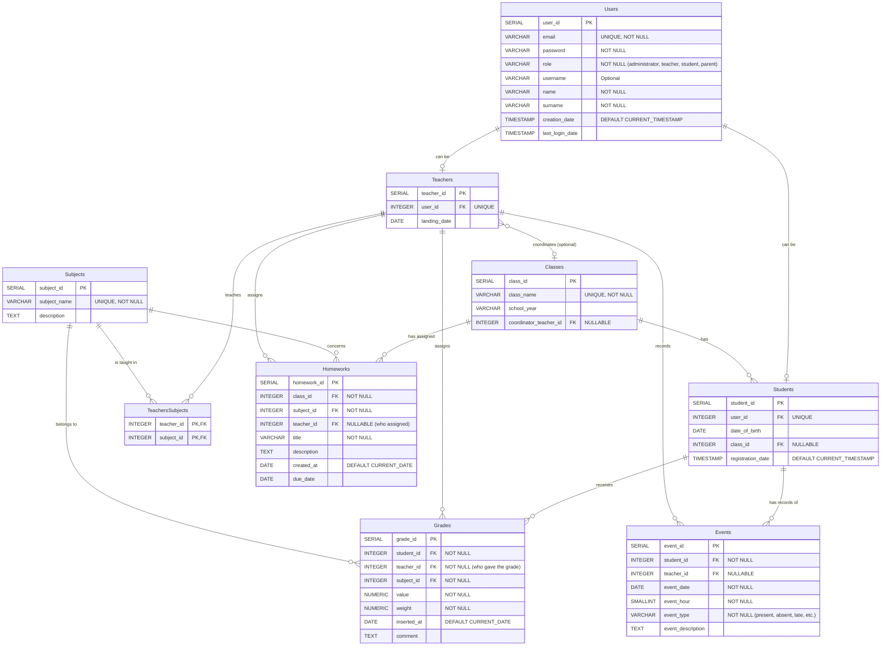

```mermaid
    erDiagram
        Users {
            SERIAL user_id PK
            VARCHAR email "UNIQUE, NOT NULL"
            VARCHAR password "NOT NULL"
            VARCHAR role "NOT NULL (administrator, teacher, student, parent)"
            VARCHAR username "Optional"
            VARCHAR name "NOT NULL"
            VARCHAR surname "NOT NULL"
            TIMESTAMP creation_date "DEFAULT CURRENT_TIMESTAMP"
            TIMESTAMP last_login_date
        }

        Students {
            SERIAL student_id PK
            INTEGER user_id FK "UNIQUE"
            DATE date_of_birth
            INTEGER class_id FK "NULLABLE"
            TIMESTAMP registration_date "DEFAULT CURRENT_TIMESTAMP"
        }

        Teachers {
            SERIAL teacher_id PK
            INTEGER user_id FK "UNIQUE"
            DATE landing_date
        }

        Classes {
            SERIAL class_id PK
            VARCHAR class_name "UNIQUE, NOT NULL"
            VARCHAR school_year
            INTEGER coordinator_teacher_id FK "NULLABLE"
        }

        Subjects {
            SERIAL subject_id PK
            VARCHAR subject_name "UNIQUE, NOT NULL"
            TEXT description
        }

        TeachersSubjects {
            INTEGER teacher_id PK, FK
            INTEGER subject_id PK, FK
        }

        Homeworks {
            SERIAL homework_id PK
            INTEGER class_id FK "NOT NULL"
            INTEGER subject_id FK "NOT NULL"
            INTEGER teacher_id FK "NULLABLE (who assigned)"
            VARCHAR title "NOT NULL"
            TEXT description
            DATE created_at "DEFAULT CURRENT_DATE"
            DATE due_date
        }

        Grades {
            SERIAL grade_id PK
            INTEGER student_id FK "NOT NULL"
            INTEGER teacher_id FK "NOT NULL (who gave the grade)"
            INTEGER subject_id FK "NOT NULL"
            NUMERIC value "NOT NULL"
            NUMERIC weight "NOT NULL"
            DATE inserted_at "DEFAULT CURRENT_DATE"
            TEXT comment
        }

        Events {
            SERIAL event_id PK
            INTEGER student_id FK "NOT NULL"
            INTEGER teacher_id FK "NULLABLE"
            DATE event_date "NOT NULL"
            SMALLINT event_hour "NOT NULL"
            VARCHAR event_type "NOT NULL (present, absent, late, etc.)"
            TEXT event_description
            %% UNIQUE (student_id, event_date, event_hour)
        }

        Users ||--o| Students : "can be"
        Users ||--o| Teachers : "can be"

        Classes ||--o{ Students : "has"
        Teachers }o--o| Classes : "coordinates (optional)"

        Teachers ||--o{ TeachersSubjects : "teaches"
        Subjects ||--o{ TeachersSubjects : "is taught in"

        Classes ||--o{ Homeworks : "has assigned"
        Subjects ||--o{ Homeworks : "concerns"
        Teachers ||--o{ Homeworks : "assigns"

        Students ||--o{ Grades : "receives"
        Teachers ||--o{ Grades : "assigns"
        Subjects ||--o{ Grades : "belongs to"

        Students ||--o{ Events : "has records of"
        Teachers ||--o{ Events : "records"

        %% Comments on foreign keys and constraints:
        %% Students.user_id -> Users.user_id (ON DELETE CASCADE)
        %% Teachers.user_id -> Users.user_id (ON DELETE CASCADE)
        %% Students.class_id -> Classes.class_id (ON DELETE SET NULL)
        %% Classes.coordinator_teacher_id -> Teachers.teacher_id (ON DELETE SET NULL)
        %% TeachersSubjects.teacher_id -> Teachers.teacher_id (ON DELETE CASCADE)
        %% TeachersSubjects.subject_id -> Subjects.subject_id (ON DELETE CASCADE)
        %% Homeworks.class_id -> Classes.class_id (ON DELETE CASCADE)
        %% Homeworks.subject_id -> Subjects.subject_id (ON DELETE CASCADE)
        %% Homeworks.teacher_id -> Teachers.teacher_id (ON DELETE SET NULL)
        %% Grades.student_id -> Students.student_id (ON DELETE CASCADE)
        %% Grades.teacher_id -> Teachers.teacher_id (ON DELETE SET NULL)
        %% Grades.subject_id -> Subjects.subject_id (ON DELETE CASCADE)
        %% Events.student_id -> Students.student_id (ON DELETE CASCADE)
        %% Events: UNIQUE (student_id, event_date, event_hour)
```
